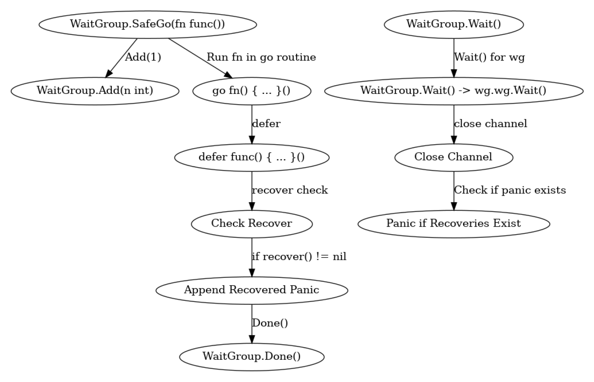

# safego

[](https://golang.org)


----

Go에서 고루틴 내에서 panic이 발생하면, 이 panic은 고루틴을 생성한 부모 함수로 전파되지 않습니다.

부모 함수에 recover 로직이 존재해도 고루틴 내에서 발생한 panic을 잡지 못하고 프로그램이 비정상적으로 종료됩니다.

이러한 현상이 발생하는 이유는 고루틴 내에서 panic이 발생할 경우, panicking 상태가 부모 고루틴에 전파되지 않기 때문입니다. 이를 해결하기 위한 방법은 다음과 같습니다.

<br>

각 고루틴마다 panic을 개별적으로 처리하고 적절히 복구하면 됩니다.

하지만, 고루틴마다 recover 로직을 구현하는 것은 번거롭습니다. 그래서 safego 패키지를 만들었습니다.

safego 패키지는 고루틴 내에서 발생한 panic을 부모 함수로 안전하게 전달할 수 있는 방법을 제공합니다.

<br>

----

## 핵심 동작 원리

아래 다이어그램은 `safego.WaitGroup`의 핵심 동작 원리를 시각적으로 설명합니다.

* safego 패키지를 사용하면 panic 발생 시 WaitGroup과의 연동 문제를 안전하게 처리할 수 있습니다. 


* wg.Done() 호출 전후에 발생하는 panic 상황 모두에서 고루틴이 정상적으로 종료되도록 보장합니다.


* 모든 고루틴이 종료될 때까지 기다리고, 발생한 panic을 한 번에 처리할 수 있습니다.



<br>

----

## safego 사용법
* SafeGo 메서드는 새로운 고루틴을 시작하고, 고루틴 내에서 panic이 발생하면 이를 채널을 통해 수집합니다.
* Wait 메서드는 모든 고루틴이 완료될 때까지 대기하고, 채널을 통해 수집된 모든 panic을 다시 panic으로 발생시킵니다.
* 테스트 케이스는 panic 발생 여부에 따라 Wait 메서드의 동작을 검증합니다.

<br>

```go
package safego

import (
	"testing"

	"github.com/stretchr/testify/assert"
)

func TestWaitGroup_NoError_Case(t *testing.T) {
	// Given
	as := assert.New(t)
	var wg WaitGroup

	// When
	wg.SafeGo(func() {
		// 정상적으로 실행되는 함수, 패닉 없음
	})

	// Then
	as.NotPanics(wg.Wait)
}

func TestWaitGroup_WithPanic_Case(t *testing.T) {
	// Given
	as := assert.New(t)
	var wg WaitGroup

	// When
	wg.SafeGo(func() {
		panic("test panic") // 여기서 패닉 발생
	})

	// Then
	as.Panics(wg.Wait) // Wait 호출 시 패닉이 발생하는지 테스트
}
```

<br>